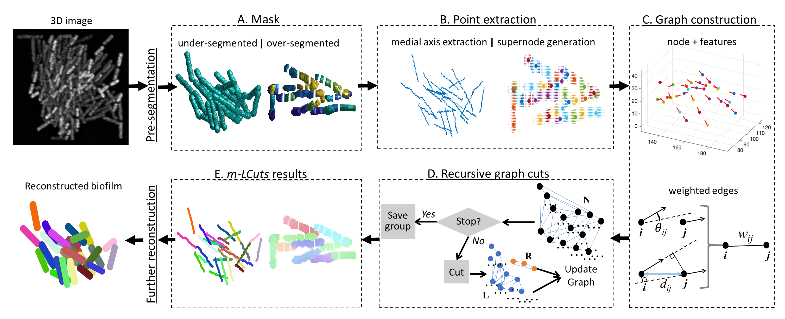

# m-LCuts
m-LCuts: masked Collinear Graph Cuts. This repo include the code to implement graph-theoretic post-processing procedure on under-segmented or/and over-segmented clusters for 3D bacterial dataset.

## Related papers
Please cite the following papers if you are referring the code. And please let me know if you have any questions. Thank you!
Email: jiewang@virginia.edu

[1]	J. Wang, M. Zhang, J. Zhang, Y. Wang, Andreas Gahlmann, and S. T. Acton, “Graph-theoretic Post-processing of Segmentation with Application to Dense Biofilms.” IEEE Transaction on Image Processing, 30, 8580-8594. (2021) [Paper](https://ieeexplore.ieee.org/abstract/document/9562258)

Due to the technical issues of the original website listed in [1] "http://viva-lab.ece.virginia.edu/pages/projects/biofilm.html", please refer to the current repo for code updates. Sorry for the inconvenience.

Prior papers:

[2] M. Zhang, J. Zhang, Y. Wang, J. Wang, A. Achimovich, S. T. Acton, and Andreas Gahlmann, “Non-Invasive Single-Cell Morphometry and Tracking in Living Bacterial Biofilms.” Nature Communications, 11(1), pp.1-13. (2020) [Paper](https://www.nature.com/articles/s41467-020-19866-8)

[3] J. Wang, T. Batabyal, M. Zhang, J. Zhang, A. Aziz, A. Gahlmann, and S.T. Acton. “LCuts: Linear Clustering of Bacteria Using Recursive Graph Cuts.” In 2019 IEEE International Conference on Image Processing (ICIP), pp. 1575-1579. (2019) [Paper](https://ieeexplore.ieee.org/abstract/document/8803064)

Other codes: [BCM3D](https://github.com/GahlmannLab/BCM3D) and [LCuts](https://github.com/jwang-c/Postprocessing-using-LCuts)

## Code description
For details, please refer to the pseudocode sections in [1].

[mLCuts.m](mLCuts.m) file is the main function -- Algorithm 1 and Figure 2 in [1].

The support functions can be catogorized based on three major sections in Algorithm 1: graph construction, recursive graph cuts, and biofilm reconstruction.

## Run the code
Just run the [demo_real.m](demo_real.m) file. Data is real bacterial biofilm data from [2].

For real data, the post-processing needs may be uncatogorized. Here, we demonstrate a possible solution. Each case, the under- or over-segmented cases, are treated separately via m-LCuts, but in a sequential manner.

For individual situation with MODE identified (point/undersegmentation or segment/oversegmentation), just run mLCuts function with inputs.

## License
This project is licensed under the MIT License - see the [LICENSE.md](LICENSE.md) file for details

## Acknowledgments
Thanks for the support from Virginia Image and Video Analysis (VIVA) Lab, University of Virginia. [Lab website](http://viva-lab.ece.virginia.edu/index.html)

Thanks for the data and biological/chemical knowledge support from the Cell imaging at Nano scale Lab, University of Virginia.
